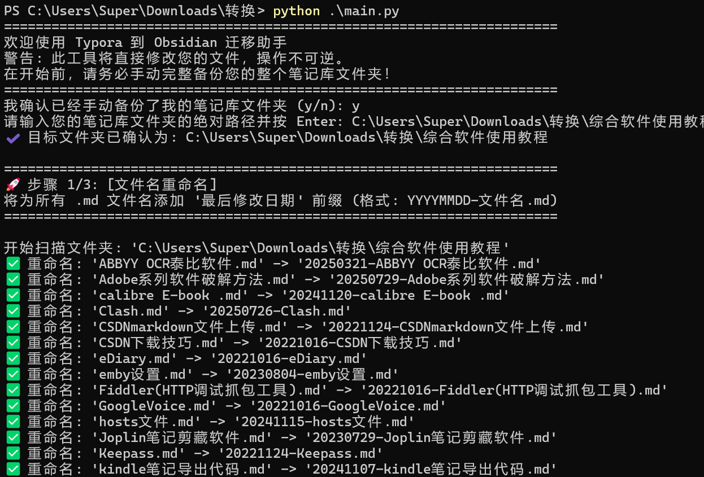
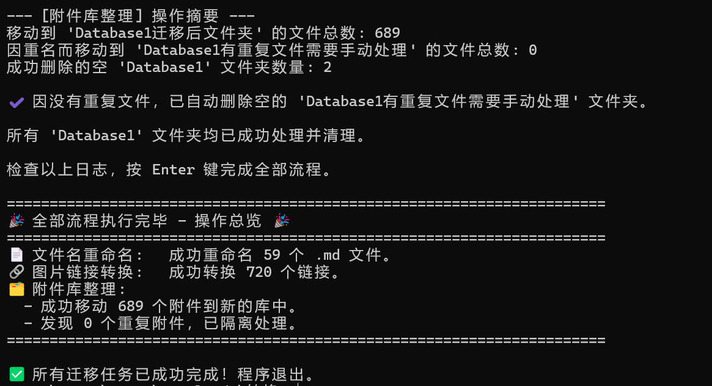

# Typora to Obsidian 迁移助手 (Typora-to-Obsidian-Migration-Helper)

一个交互式的、基于状态机模式的 Python 脚本，旨在帮助用户安全、高效地将 Typora 笔记库迁移至 Obsidian。它将多个繁琐的手动步骤整合为一个自动化的、可控的流程。

## 📖 简介

当您决定将主力笔记应用从 Typora 切换到 Obsidian 时，通常会面临几个棘手的问题：

1. **图片链接不兼容**：Typora 使用标准的 Markdown 相对路径链接 (``)，而 Obsidian 推荐使用更简洁、更强大的双链格式 (`![[image.png]]`)。
   
2. **附件管理混乱**：Typora 倾向于为每个笔记或每个子文件夹创建一个独立的附件文件夹（默认为 `Database`），导致附件散落在笔记库的各个角落，难以统一管理。
   
3. **笔记命名缺乏时间戳**：为笔记文件名添加创建或修改日期前缀，有助于在 Obsidian 中进行更有效的时间线排序和回顾。
   

本工具旨在一次性解决以上所有问题，通过一个引导式的命令行界面，让迁移过程变得简单而透明。






## ✨ 主要特性

- **🤖 状态机驱动**：整个流程由清晰的状态机控制，确保每一步都按预定顺序执行。
  
- **🛡️ 交互式确认**：在执行每一项核心操作（重命名、链接转换、附件整理）后，程序会暂停并等待用户确认，给予用户充足的时间检查日志，确保万无一失。
  
- **📂 单文件运行**：无需安装任何第三方库，仅依赖 Python 标准库，下载即用。
  
- **三合一核心功能**：
  1. **文件名批量重命名**：自动为所有 `.md` 文件名添加其“最后修改日期”作为前缀（格式：`YYYYMMDD-笔记名.md`）。
     
    2. **图片链接格式转换**：智能识别并转换 Typora 风格的图片链接为 Obsidian 兼容的双链格式。
       
    3. **附件库整合与清理**：将所有散落的附件文件夹（默认为 `Database`）内的文件，统一移动到一个新的、位于根目录的附件库中（`DatabaseNew`），并自动处理重复文件和清理空文件夹。
       

## 🚀 如何使用

### ✅ 准备工作

1. **安装 Python**：确保您的电脑上已安装 Python 3.6 或更高版本。
   
2. **下载脚本**：将 `main.py` 脚本文件下载到您的电脑任意位置。
   
3. **‼️ 最重要的一步：备份！** 在运行此脚本前，**请务必、务必、务必手动完整备份您的整个笔记库文件夹！** 本脚本的操作是不可逆的，备份是您唯一的“后悔药”。
   

### 🏃‍♀️ 运行流程

1. **打开终端**：
   
    - 在 Windows 上，打开 `命令提示符(CMD)` 或 `PowerShell`。
      
    - 在 macOS 或 Linux 上，打开 `终端(Terminal)`。
    
2. **运行脚本**：使用 `python` 命令来执行脚本。
   
    ```
    python /path/to/your/main.py
    ```
    
    _(请将 `/path/to/your/main.py` 替换为您存放 `main.py` 的实际路径)_
    
3. **按照提示操作**：脚本启动后，会引导您完成以下步骤：
   
    - **确认备份**：首先会要求您确认是否已完成备份。
      
    - **输入路径**：提示您输入要处理的笔记库根文件夹的绝对路径。可以直接从文件管理器复制路径并粘贴。
      
    - **分步执行与确认**：
      
        1. **执行文件名重命名** -> 打印日志 -> **等待您按 Enter 确认**。
           
        2. **执行图片链接转换** -> 打印日志 -> **等待您按 Enter 确认**。
           
        3. **执行附件库整理** -> 打印日志 -> **等待您按 Enter 确认**。
        
    - **完成**：所有步骤确认后，程序会打印最终的操作总览并退出。
      

## 🔬 执行结果详解

假设您的原始笔记库结构如下：

```
MyNotes/
├── 日常笔记/
│   ├── 一篇关于猫的笔记.md
│   └── 一篇关于猫的笔记.assets/
│       └── cat_photo.png
└── 技术分享/
    ├── K8s学习.md
    └── K8s学习.assets/
        └── k8s_arch.png
```

运行脚本并完成所有步骤后，您的笔记库结构将变为：

```
MyNotes/
├── 日常笔记/
│   └── 20251001-一篇关于猫的笔记.md  <-- 文件名已修改
└── 技术分享/
│   └── 20250928-K8s学习.md        <-- 文件名已修改
│
├── K8s学习.assets/               <-- 旧的空附件文件夹已被自动删除
├── 一篇关于猫的笔记.assets/        <-- 旧的空附件文件夹已被自动删除
│
├── DatabaseNew/                    <-- 新创建的统一附件库
│   ├── cat_photo.png               <-- 附件已移入
│   └── k8s_arch.png                <-- 附件已移入
│
└── Database重复文件手动处理/         <-- (如果存在重名附件)
```

**同时，笔记文件内的内容也会发生变化：**

- **修改前** (`一篇关于猫的笔记.md`):
  
    ```
    这是一只可爱的猫。
    
    ```
    
- **修改后** (`20251001-一篇关于猫的笔记.md`):
  
    ```
    这是一只可爱的猫。
    ![[cat_photo.png]]
    ```
    

**最终，终端会显示类似这样的摘要报告：**

```
======================================================================
🎉 全部流程执行完毕 - 操作总览 🎉
======================================================================
📄 文件名重命名:   成功重命名 2 个 .md 文件。
🔗 图片链接转换:   成功转换 2 个链接。
🗂️ 附件库整理:
  - 成功移动 2 个附件到新的库中。
  - 发现 0 个重复附件，已隔离处理。
======================================================================

✅ 所有迁移任务已成功完成！程序退出。
```

## ⚠️ 注意事项

- 本脚本会**直接修改**您指定文件夹内的文件，所有操作都是**不可逆**的。请务必在运行前进行备份。
  
- 在每一步确认前，请仔细检查终端打印的日志，确保操作符合您的预期。
  
- 如果中途输入 `'n'` 退出，已经完成的步骤不会撤销。
  
- 如果在附件整理步骤中出现重名文件，它们会被移动到 `Database重复文件手动处理` 文件夹中，需要您手动检查和决定保留哪一个。如果没有任何重名文件，该文件夹会被自动删除。
  

## 📜 许可证

本项目采用 [MIT License](https://opensource.org/licenses/MIT "null") 授权。